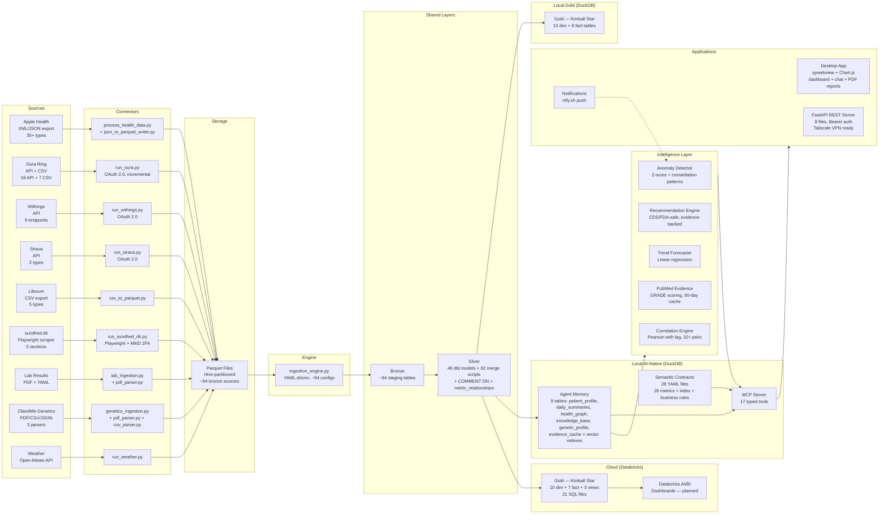
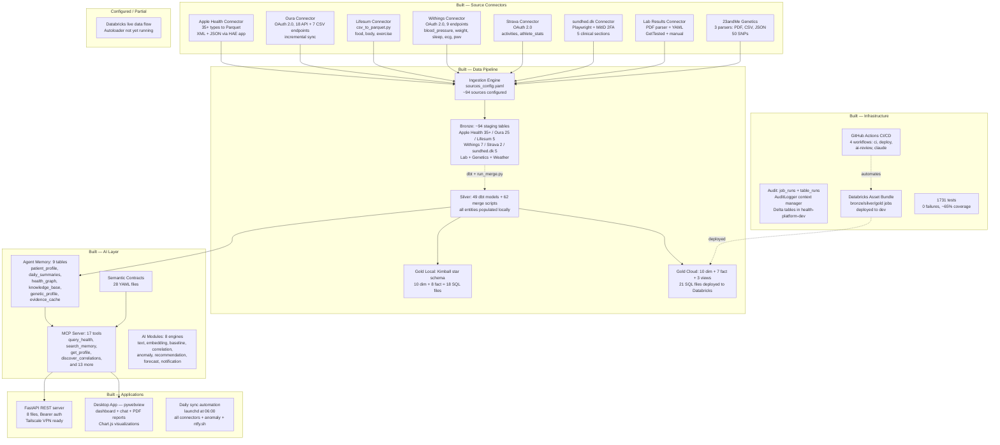

# ARCHITECTURE.md — HealthReporting

> Last updated: 2026-03-14
> For technical implementation details (silver pattern, merge scripts, hive partitioning), see `docs/architecture.md`.
> For C4 architecture diagrams (Context → Container → Component) and solution architecture narrative, see [`c4-architecture.md`](./c4-architecture.md).

---

## Architecture Diagrams (Draw.io)

All diagrams in `docs/architecture/`. Open with Draw.io desktop or app.diagrams.net.

### System-Level Diagrams

| Diagram | File | Description |
|---------|------|-------------|
| C4 Level 1 — Context | [`c4-level1-context.drawio`](architecture/c4-level1-context.drawio) | System context — users, external systems |
| C4 Level 2 — Containers | [`c4-level2-containers.drawio`](architecture/c4-level2-containers.drawio) | Container decomposition — services, stores |
| C4 Level 3 — Components | [`c4-level3-components.drawio`](architecture/c4-level3-components.drawio) | Component detail — modules within containers |
| Solution Architecture | [`solution-architecture.drawio`](architecture/solution-architecture.drawio) | End-to-end solution narrative |

### Source Lineage Diagrams (per-source, 6-column layout)

Each diagram shows the complete flow: Source → Ingestion → Bronze → Merge → Silver → Downstream.

| Diagram | File | Bronze | Merge | Canvas |
|---------|------|--------|-------|--------|
| **Source Overview** | [`source-overview.drawio`](architecture/source-overview.drawio) | 91 total | 62 total | 2200×1400 |
| Apple Health | [`apple-health.drawio`](architecture/apple-health.drawio) | 38 | 24 | 1800×1200 |
| Oura Ring | [`oura-ring.drawio`](architecture/oura-ring.drawio) | 20 | 20 | 1800×1400 |
| Withings | [`withings.drawio`](architecture/withings.drawio) | 18 | 8 | 1800×1400 |
| sundhed.dk | [`sundhed-dk.drawio`](architecture/sundhed-dk.drawio) | 5 | 0* | 1600×1000 |
| Lifesum | [`lifesum.drawio`](architecture/lifesum.drawio) | 4 | 4 | 1400×900 |
| Lab Results | [`lab-results.drawio`](architecture/lab-results.drawio) | 3 | 1 | 1400×800 |
| Strava | [`strava.drawio`](architecture/strava.drawio) | 2 | 1 | 1400×800 |
| Weather | [`weather.drawio`](architecture/weather.drawio) | 1 | 1 | 1200×700 |
| 23andMe Genetics | [`23andme-genetics.drawio`](architecture/23andme-genetics.drawio) | 0* | 3 | 1400×900 |

\* = planned/partial

---

## High-Level Data Flow — Dual-Stack Architecture

The platform uses a **dual-stack architecture** (ADR-005):
- **Local (Mac Mini M4):** AI-Native 2+2 — Silver → Gold (Kimball star) + Agent Memory + Semantic Contracts (AI-optimized)
- **Cloud (Databricks):** Traditional medallion — Silver → Gold views (human-optimized, dashboards)

Silver layer is shared. Divergence happens after Silver.



---

## Current State (What Exists Today)



---

## Medallion Layer Detail

### Bronze (Raw Ingestion)

~94 staging tables from 9 source systems. Key tables listed below.

| Source | Tables | Status | Notes |
|--------|--------|--------|-------|
| Apple Health | 35+ tables (stg_apple_health_*) | Active | heart_rate, step_count, toothbrushing, body_temperature, respiratory_rate, water_intake, mindful_session, walking_gait, energy, vo2_max, hrv, resting_hr, distance, flights_climbed, exercise_time, stand_time, running_speed, six_min_walk, audio_exposure, physical_effort, blood_pressure, hand_washing, hr_recovery, body_measurement, and more |
| Oura | 25 tables (stg_oura_*) | Active | 18 API endpoints (daily_sleep, daily_activity, daily_readiness, heartrate, workout, daily_spo2, daily_stress, personal_info, blood_oxygen, etc.) + 7 CSV types (cardiovascular_age, daily_resilience, daytime_stress, enhanced_tag, skin_temperature, sleep_recommendation, sleep_session) |
| Lifesum | 5 tables (stg_lifesum_*) | Active | food, bodyfat, bodymeasures, exercise, weighins |
| Withings | 7 tables (stg_withings_*) | Active | blood_pressure, weight, body_temperature, body_measurement, ecg_session, pulse_wave_velocity, sleep_session |
| Strava | 2 tables (stg_strava_*) | Active | activities, athlete_stats |
| sundhed.dk | 5 tables (stg_sundhed_dk_*) | Active | lab_results, medications, vaccinations, ejournal, appointments |
| Lab Results | Variable (stg_lab_*) | Active | PDF-parsed lab results (GetTested + manual) |
| 23andMe Genetics | Variable (stg_genetics_*) | Active | 3 parsers: ancestry, family_tree, health_findings |
| Weather | 1 table (stg_weather_*) | Active | Open-Meteo daily weather data |

### Silver (Cleaned and Transformed)

49 dbt schema models + 62 merge SQL scripts + 1 merge runner (`run_merge.py`). All run locally via DuckDB. 28 SQL files deployed to Databricks (27 transforms + 1 template).

| Entity | Sources | Local | Databricks | Merge Script |
|--------|---------|-------|------------|--------------|
| heart_rate | Apple Health + Oura | Done | SQL file | merge_apple_health_heart_rate + merge_oura_heartrate |
| step_count | Apple Health | Done | SQL file | merge_apple_health_step_count |
| toothbrushing | Apple Health | Done | SQL file | merge_apple_health_toothbrushing |
| body_temperature | Apple Health + Withings | Done | SQL file | merge_apple_health_body_temperature + merge_withings_body_temperature |
| respiratory_rate | Apple Health | Done | SQL file | merge_apple_health_respiratory_rate |
| water_intake | Apple Health | Done | SQL file | merge_apple_health_water |
| mindful_session | Apple Health | Done | SQL file | merge_apple_health_mindful_session |
| daily_walking_gait | Apple Health | Done | SQL file | merge_apple_health_walking_gait |
| daily_energy_by_source | Apple Health | Done | SQL file | merge_apple_health_energy |
| daily_sleep | Oura | Done | SQL file | merge_oura_daily_sleep |
| daily_activity | Oura | Done | SQL file | merge_oura_daily_activity |
| daily_readiness | Oura | Done | SQL file | merge_oura_daily_readiness |
| workout | Oura + Strava | Done | SQL file | merge_oura_workout + merge_strava_activities |
| daily_spo2 | Oura | Done | SQL file | merge_oura_daily_spo2 |
| daily_stress | Oura | Done | SQL file | merge_oura_daily_stress |
| personal_info | Oura | Done | — | merge_oura_personal_info |
| daily_meal | Lifesum | Done | SQL file | merge_lifesum_food |
| daily_annotations | Manual | Done | SQL file | — |
| blood_pressure | Apple Health + Withings | Done | SQL file | merge_apple_health_blood_pressure_v2 + merge_withings_blood_pressure |
| blood_pressure_v2 | Withings | Done | — | merge_withings_blood_pressure_v2 |
| weight | Lifesum + Withings | Done | SQL file | merge_lifesum_weighins + merge_withings_weight |
| blood_oxygen | Oura | Done | SQL file | merge_oura_blood_oxygen |
| lab_results | Lab PDFs | Done | SQL file | merge_lab_pdf_results |
| supplement_log | Manual | Done | SQL file | — |
| body_measurement | Apple Health + Withings | Done | — | merge_apple_health_body_measurement + merge_withings_body_measurement |
| body_fat | Lifesum | Done | — | merge_lifesum_bodyfat |
| body_measures | Lifesum | Done | — | merge_lifesum_bodymeasures |
| audio_exposure | Apple Health | Done | — | merge_apple_health_audio_exposure |
| distance | Apple Health | Done | — | merge_apple_health_distance |
| exercise_time | Apple Health | Done | — | merge_apple_health_exercise_time |
| flights_climbed | Apple Health | Done | — | merge_apple_health_flights_climbed |
| hand_washing | Apple Health | Done | — | merge_apple_health_hand_washing |
| hr_recovery | Apple Health | Done | — | merge_apple_health_hr_recovery |
| hrv | Apple Health | Done | SQL file | merge_apple_health_hrv |
| physical_effort | Apple Health | Done | — | merge_apple_health_physical_effort |
| resting_heart_rate | Apple Health | Done | SQL file | merge_apple_health_resting_heart_rate |
| running_speed | Apple Health | Done | — | merge_apple_health_running_speed |
| six_min_walk | Apple Health | Done | — | merge_apple_health_six_min_walk |
| stand_time | Apple Health | Done | — | merge_apple_health_stand_time |
| vo2_max | Apple Health | Done | SQL file | merge_apple_health_vo2_max |
| cardiovascular_age | Oura CSV | Done | — | merge_oura_csv_cardiovascular_age |
| daily_resilience | Oura CSV | Done | SQL file | merge_oura_csv_daily_resilience |
| daytime_stress | Oura CSV | Done | — | merge_oura_csv_daytime_stress |
| enhanced_tag | Oura CSV | Done | — | merge_oura_csv_enhanced_tag |
| skin_temperature | Oura CSV | Done | — | merge_oura_csv_skin_temperature |
| sleep_recommendation | Oura CSV | Done | — | merge_oura_csv_sleep_recommendation |
| sleep_session | Oura CSV + Withings | Done | — | merge_oura_csv_sleep_session + merge_withings_sleep_session |
| ecg_session | Withings | Done | — | merge_withings_ecg_session |
| pulse_wave_velocity | Withings | Done | — | merge_withings_pulse_wave_velocity |
| weather_daily | Open-Meteo | Done | — | merge_weather_daily |
| genetic_findings | 23andMe | Done | — | merge_23andme_health_findings + merge_23andme_ancestry + merge_23andme_family_tree |

### Gold (Reporting-Ready — Kimball Star Schema)

Gold layer exists in **both** stacks with a Kimball dimensional model.

#### Local Gold (DuckDB) — 18 SQL files

| Type | Tables | Files |
|------|--------|-------|
| Dimensions | dim_body_system, dim_date, dim_health_zone, dim_lab_marker, dim_meal_type, dim_metric, dim_source, dim_supplement, dim_time_of_day, dim_workout_type | 10 |
| Facts | fct_body_measurement, fct_daily_health_score, fct_daily_heart_rate_summary, fct_daily_nutrition, fct_daily_vitals_summary, fct_lab_result, fct_sleep_session, fct_workout | 8 |

#### Cloud Gold (Databricks) — 21 SQL files

| Type | Tables | Files |
|------|--------|-------|
| Dimensions | dim_body_system, dim_date, dim_health_zone, dim_lab_marker, dim_meal_type, dim_metric, dim_source, dim_supplement, dim_time_of_day, dim_workout_type | 10 |
| Facts | fct_body_measurement, fct_daily_health_score, fct_daily_nutrition, fct_daily_vitals_summary, fct_lab_result, fct_sleep_session, fct_workout | 7 |
| Legacy Views | daily_heart_rate_summary, vw_daily_annotations, vw_heart_rate_avg_per_day | 3 |
| **Total** | | **20** (+ 1 legacy overlap with local) |

---

## AI-Native Data Model (Local Stack)

Replaces traditional BI locally with a 2+2 architecture. See ADR-005 for full rationale.

### Agent Memory (`agent` schema in DuckDB) — 9 tables

| Table | Purpose | Notes |
|-------|---------|-------|
| `agent.patient_profile` | Core memory — demographics + baselines, always in context | ~9 rows, ~2000 tokens |
| `agent.daily_summaries` | Recall memory — one row per day + 384-dim embeddings | ~91+ rows, growing |
| `agent.health_graph` | Relationship memory — knowledge graph nodes | ~67 nodes |
| `agent.health_graph_edges` | Relationship memory — graph edges | ~108 edges |
| `agent.knowledge_base` | Archival memory — accumulated insights (vector-searchable) | Grows over time |
| `agent.genetic_profile` | Genetic findings — static SNP-level data from 23andMe | ~50 SNPs |
| `silver.metric_relationships` | Computed metric correlations (Pearson with lag) | 32+ pairs |
| `agent.evidence_cache` | PubMed evidence cache — GRADE-scored articles | 90-day TTL |
| `agent.vector_indexes` | HNSW indexes for embeddings (cosine similarity) | Auto-maintained |

### Semantic Contracts (`contracts/metrics/`) — 28 YAML files

| File | Purpose |
|------|---------|
| `_index.yml` | Master index — 9 categories, query routing, schema pruning config |
| `_business_rules.yml` | Composite health score (35/35/30), 5 alerts, anomaly detection |
| `activity_score.yml` | Oura daily activity score |
| `blood_oxygen.yml` | SpO2 blood oxygen |
| `blood_pressure.yml` | Systolic/diastolic blood pressure |
| `body_temperature.yml` | Body temperature |
| `calories.yml` | Caloric intake/expenditure |
| `daily_stress.yml` | Oura daily stress |
| `genetics.yml` | Genetic findings and risk factors |
| `gold_views.yml` | Gold layer view definitions |
| `lab_biomarkers.yml` | Lab test biomarkers |
| `lab_results.yml` | Lab result definitions |
| `microbiome.yml` | Microbiome analysis markers |
| `mindful_session.yml` | Mindfulness/meditation sessions |
| `patient_demographics.yml` | Patient demographic data |
| `protein.yml` | Protein intake |
| `readiness_score.yml` | Oura readiness score |
| `respiratory_rate.yml` | Respiratory rate |
| `resting_heart_rate.yml` | Resting heart rate |
| `sleep_score.yml` | Oura sleep score |
| `steps.yml` | Daily step count |
| `supplements.yml` | Supplement tracking |
| `toothbrushing.yml` | Oral hygiene tracking |
| `walking_gait.yml` | Walking gait metrics |
| `water_intake.yml` | Water intake |
| `weather.yml` | Weather correlation data |
| `weight.yml` | Body weight |
| `workout.yml` | Workout and exercise |

### MCP Server (`mcp/server.py` — 17 tools)

| Tool | Purpose |
|------|---------|
| `query_health` | Query any metric via Semantic Contract |
| `search_memory` | Vector search across summaries + knowledge base |
| `get_profile` | Load core memory (~2000 tokens) |
| `discover_correlations` | Compute/retrieve metric correlations |
| `get_metric_definition` | Read YAML contract for a metric |
| `record_insight` | Save to knowledge base |
| `get_schema_context` | Schema pruning — only relevant tables |
| `run_custom_query` | Escape hatch (read-only SELECT only) |
| `check_data_quality` | Freshness, null rates, row counts per table |
| `search_evidence` | PubMed literature search with GRADE scoring |
| `detect_anomalies` | Z-score and constellation pattern detection |
| `forecast_metric` | Linear regression trend forecasting |
| `get_cross_source_insights` | Cross-source data fusion and insights |
| `get_recommendations` | Evidence-backed health recommendations (CDS/FDA-safe) |
| `explain_recommendation` | Detailed explanation of a specific recommendation |
| `query_lab_results` | Query lab biomarker results and trends |
| `query_genetics` | Query genetic findings and risk factors |

### AI Modules (`ai/`) — 8 engines

| Module | Purpose |
|--------|---------|
| `text_generator.py` | Template-based daily health summaries |
| `embedding_engine.py` | sentence-transformers (all-MiniLM-L6-v2) embeddings + vector search |
| `baseline_computer.py` | Rolling baselines + demographics → patient_profile |
| `correlation_engine.py` | Pearson correlations with lag → metric_relationships (32+ pairs) |
| `anomaly_detector.py` | Z-score anomaly detection + constellation patterns (multi-metric) |
| `recommendation_engine.py` | CDS/FDA-safe health recommendations, evidence-backed |
| `trend_forecaster.py` | Linear regression forecasting for health metrics |
| `notification_manager.py` | ntfy.sh push notifications for alerts and anomalies |

---

## Applications

### Desktop App (`desktop/`) — pywebview

| Component | File | Purpose |
|-----------|------|---------|
| App entry | `app.py`, `__main__.py` | pywebview window + lifecycle |
| Desktop API | `api.py` | JavaScript ↔ Python bridge |
| Dev seeder | `seed_dev_db.py` | Synthetic data for development |
| PDF Reports | `reports/generator.py` | weasyprint PDF generation |
| Report Templates | `reports/templates/*.html` | 7 section templates (summary, vitals, sleep, activity, nutrition, alerts, trends) |
| UI | `ui/index.html` + `ui/css/` + `ui/js/` | Dashboard HTML/CSS/JS + Chart.js |
| App Bundle | `bundle/build_app.py`, `setup_py2app.py`, `Info.plist` | py2app packaging for macOS .app |

### FastAPI REST Server (`api/`) — 8 files

| Component | File | Purpose |
|-----------|------|---------|
| Server | `server.py` | FastAPI app, 5+ endpoints, CORS |
| Auth | `auth.py` | Bearer token authentication (Keychain + env) |
| Chat Engine | `chat_engine.py` | Claude streaming + multi-turn conversation |
| Chat UI | `chat_ui.py` | Web-based chat interface |

---

## Audit Layer

| Component | Description | Status |
|-----------|-------------|--------|
| AuditLogger | Python context manager, auto-detects DuckDB/Databricks | Done |
| audit.job_runs | Delta table — pipeline run metadata | Live in health-platform-dev |
| audit.table_runs | Delta table — per-table row counts | Live in health-platform-dev |
| audit.v_platform_overview | View — 7-day success/error summary | Done |

---

## File Structure Map

```
HealthReporting/
├── CLAUDE.md                                  # session governance + conventions
├── docs/
│   ├── CONTEXT.md                             # project scope and data sources
│   ├── PROJECT_PLAN.md                        # phases and milestones
│   ├── ARCHITECTURE.md                        # this file — governance view
│   ├── CHANGELOG.md                           # session log
│   ├── architecture.md                        # technical reference (silver pattern, merge scripts)
│   ├── learnings.md                           # architectural decisions and lessons
│   ├── paths.md                               # key file paths
│   ├── runbook.md                             # how to run the platform locally
│   └── adr/                                   # 5 Architecture Decision Records
│       ├── ADR-001-duckdb-local-runtime.md
│       ├── ADR-002-medallion-architecture.md
│       ├── ADR-003-yaml-driven-pipeline.md
│       ├── ADR-004-feature-branch-workflow.md
│       └── ADR-005-ai-native-data-model.md
├── tests/                                     # 56 test files, 1334 tests
├── scripts/
│   ├── daily_sync.sh                          # multi-step pipeline: connectors → bronze → silver → summary → anomaly
│   └── launchd/
│       ├── com.health.daily-sync.plist        # Daily at 06:00
│       └── com.health.api-server.plist        # Always-on FastAPI
├── .github/
│   └── workflows/                             # 4 CI/CD workflows
│       ├── ci.yml                             # pytest + ruff + secret scan + Dependabot
│       ├── deploy.yml                         # Databricks bundle deploy (dev + prd)
│       ├── ai-review.yml                      # AI-powered PR review
│       └── claude.yml                         # Claude Code automation
├── .claude/
│   ├── commands/                              # 10 slash commands
│   └── agents/                                # 12 custom agents
└── health_unified_platform/
    ├── health_environment/
    │   ├── config/
    │   │   ├── environment_config.yaml
    │   │   └── sources_config.yaml            # ~94 sources configured
    │   ├── connectors/
    │   │   └── oura/                          # OAuth 2.0 connector (auth, client, writer, state)
    │   └── deployment/
    │       └── databricks/
    │           ├── databricks.yml              # DAB bundle root
    │           ├── init.py                     # one-time schema + audit setup
    │           ├── orchestration/              # bronze_job.yml, silver_job.yml, gold_job.yml
    │           └── setup_audit_tables.sql
    └── health_platform/
        ├── ai/                                 # 8 AI intelligence modules
        │   ├── text_generator.py               # daily summary generation
        │   ├── embedding_engine.py             # sentence-transformers embeddings
        │   ├── baseline_computer.py            # rolling baselines + demographics
        │   ├── correlation_engine.py           # metric correlations (Pearson + lag)
        │   ├── anomaly_detector.py             # Z-score + constellation patterns
        │   ├── recommendation_engine.py        # CDS/FDA-safe recommendations
        │   ├── trend_forecaster.py             # linear regression forecasting
        │   └── notification_manager.py         # ntfy.sh push notifications
        ├── contracts/                          # Semantic Contracts
        │   └── metrics/
        │       ├── _index.yml                  # master index + query routing
        │       ├── _business_rules.yml         # composite score + alerts
        │       └── 24 metric YAMLs             # per-metric definitions
        ├── desktop/                            # Desktop App (pywebview)
        │   ├── app.py, __main__.py             # pywebview entry + lifecycle
        │   ├── api.py                          # JS ↔ Python bridge
        │   ├── seed_dev_db.py                  # synthetic dev data
        │   ├── reports/
        │   │   ├── generator.py                # weasyprint PDF generation
        │   │   └── templates/                  # 7 HTML section templates
        │   ├── ui/                             # HTML/CSS/JS dashboard
        │   └── bundle/                         # py2app macOS packaging
        ├── api/                                # FastAPI REST Server
        │   ├── server.py                       # FastAPI, 5+ endpoints
        │   ├── auth.py                         # Bearer token (Keychain + env)
        │   ├── chat_engine.py                  # Claude streaming + multi-turn
        │   └── chat_ui.py                      # web chat interface
        ├── mcp/                                # MCP Server — 17 tools
        │   ├── server.py                       # FastMCP server, tool registration
        │   ├── health_tools.py                 # tool implementations
        │   ├── query_builder.py                # YAML → parameterized SQL
        │   ├── formatter.py                    # markdown output formatting
        │   └── schema_pruner.py                # category-based schema pruning
        ├── setup/                              # Schema Setup (DDL + seeds)
        │   ├── create_agent_schema.sql         # DDL for agent.* tables
        │   ├── create_agent_chat_schema.sql    # DDL for agent_chat schema
        │   ├── create_genetics_silver_schema.sql # DDL for genetics silver tables
        │   ├── create_lab_and_supplements_schema.sql # DDL for lab + supplement tables
        │   ├── add_column_comments.sql         # COMMENT ON for all silver tables
        │   ├── seed_health_graph.sql           # 67 nodes, 108 edges
        │   ├── populate_genetic_profile.sql    # SNP data → genetic_profile
        │   └── setup_agent_schema.py           # idempotent setup runner
        ├── source_connectors/
        │   ├── base.py                         # base connector class
        │   ├── csv_to_parquet.py               # Lifesum and generic CSV
        │   ├── apple_health/
        │   │   ├── process_health_data.py      # XML → Parquet
        │   │   └── json_to_parquet_writer.py   # JSON → Parquet (HAE app)
        │   ├── oura/                           # run_oura.py, auth.py, client.py, state.py, writer.py
        │   ├── withings/                       # run_withings.py, auth.py, client.py
        │   ├── strava/                         # run_strava.py, auth.py, client.py, state.py, writer.py
        │   ├── sundhed_dk/                     # run_sundhed_dk.py, browser.py, scraper.py, parsers.py
        │   ├── weather/                        # run_weather.py, client.py
        │   ├── lab/                            # lab_ingestion.py, pdf_parser.py
        │   └── genetics/                       # genetics_ingestion.py, pdf_parser.py, csv_parser.py
        ├── utils/
        │   ├── audit_logger.py                 # AuditLogger context manager
        │   └── logging_config.py               # Python logging setup
        └── transformation_logic/
            ├── ingestion_engine.py              # YAML-driven + post-merge summary trigger
            ├── dbt/
            │   ├── models/silver/              # 51 schema-only dbt models
            │   └── merge/
            │       ├── run_merge.py            # merge runner (splits on semicolons)
            │       └── silver/                 # 59 merge SQL scripts
            ├── gold/
            │   └── sql/                        # 18 local gold SQL files (10 dim + 8 fact)
            └── databricks/
                ├── bronze/                     # bronze_autoloader.py
                ├── silver/sql/                 # 28 Databricks SQL files (27 transforms + 1 template)
                ├── gold/sql/                   # 21 SQL files (10 dim + 7 fact + 3 views)
                └── audit_logger_notebook.py
```

---

## Technology Stack

| Layer | Local (dev) | Cloud (prd) |
|-------|-------------|-------------|
| Runtime | DuckDB | Databricks |
| Storage | Parquet (hive-partitioned) | Delta Lake (Unity Catalog) |
| Orchestration | Python + launchd | Databricks Workflows (DAB) |
| Config | YAML (sources_config.yaml) | YAML |
| Catalog | — | health-platform-dev / health-platform-prd |
| Schemas | bronze, silver, gold, agent, agent_chat, genetics | bronze, silver, gold, audit |
| AI Layer | Agent Memory + MCP + Semantic Contracts | — |
| Embeddings | sentence-transformers (all-MiniLM-L6-v2) | — |
| Vector Search | DuckDB VSS (HNSW, cosine, 384-dim) | — |
| Intelligence | Anomaly detection (Z-score + constellation) + Recommendations (CDS/FDA-safe) + PubMed evidence (GRADE) + Trend forecasting (linear regression) | — |
| Desktop | pywebview + Chart.js + weasyprint PDF reports | — |
| API | FastAPI (Tailscale VPN) + Bearer auth | — |
| Notifications | ntfy.sh push notifications | — |
| CI/CD | — | GitHub Actions (ci.yml, deploy.yml, ai-review.yml, claude.yml) |
| Automation | launchd (daily sync 06:00 + API server always-on) | Databricks Workflows |
| Reporting | MCP tools → Claude Code / Desktop App | Databricks AI/BI (planned) |
| Audit | AuditLogger to DuckDB | AuditLogger to Delta |
| Testing | pytest (56 files, 1334 tests, ~65% coverage) | — |
