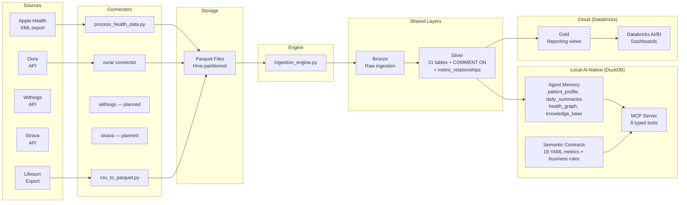
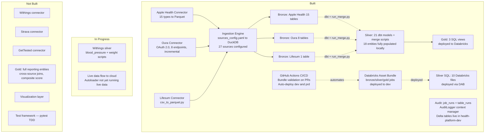

# ARCHITECTURE.md — HealthReporting

> Last updated: 2026-03-04
> For technical implementation details (silver pattern, merge scripts, hive partitioning), see `docs/architecture.md`.

---

## High-Level Data Flow — Dual-Stack Architecture

The platform uses a **dual-stack architecture** (ADR-005):
- **Local (Mac Mini M4):** AI-Native 2+2 — Silver → Agent Memory + Semantic Contracts (AI-optimized)
- **Cloud (Databricks):** Traditional medallion — Silver → Gold views (human-optimized, dashboards)

Silver layer is shared. Divergence happens after Silver.



---

## Current State (What Exists Today)



---

## Medallion Layer Detail

### Bronze (Raw Ingestion)

| Table | Source | Status |
|-------|--------|--------|
| stg_apple_health_heart_rate | Apple Health | done |
| stg_apple_health_step_count | Apple Health | done |
| stg_apple_health_toothbrushing | Apple Health | done |
| stg_apple_health_body_temperature | Apple Health | done |
| stg_apple_health_respiratory_rate | Apple Health | done |
| stg_apple_health_water_intake | Apple Health | done |
| stg_apple_health_mindful_session | Apple Health | done |
| stg_apple_health_daily_walking_gait | Apple Health | done |
| stg_apple_health_daily_energy_by_source | Apple Health | done |
| stg_apple_health_* (6 more) | Apple Health | done |
| stg_oura_daily_sleep | Oura | done |
| stg_oura_daily_activity | Oura | done |
| stg_oura_daily_readiness | Oura | done |
| stg_oura_heartrate | Oura | done |
| stg_oura_workout | Oura | done |
| stg_oura_daily_spo2 | Oura | done |
| stg_oura_daily_stress | Oura | done |
| stg_oura_personal_info | Oura | done |
| stg_lifesum_food | Lifesum | done |
| stg_withings_* | Withings | not started |
| stg_strava_* | Strava | not started |
| stg_gettested_* | GetTested | not started |

### Silver (Cleaned and Transformed)

21 dbt schema models + 21 merge scripts. All run locally via DuckDB. 10 SQL files deployed to Databricks.

| Entity | Sources | Local | Databricks |
|--------|---------|-------|------------|
| heart_rate | Apple Health + Oura | done | SQL file |
| step_count | Apple Health | done | — |
| toothbrushing | Apple Health | done | — |
| body_temperature | Apple Health | done | — |
| respiratory_rate | Apple Health | done | — |
| water_intake | Apple Health | done | — |
| mindful_session | Apple Health | done | — |
| daily_walking_gait | Apple Health | done | — |
| daily_energy_by_source | Apple Health | done | — |
| daily_sleep | Oura | done | SQL file |
| daily_activity | Oura | done | SQL file |
| daily_readiness | Oura | done | SQL file |
| workout | Oura | done | — |
| daily_spo2 | Oura | done | — |
| daily_stress | Oura | done | — |
| personal_info | Oura | done | — |
| daily_meal | Lifesum | done | SQL file |
| blood_pressure | Withings | partial | — |
| weight | Withings | partial | — |
| daily_annotations | Manual | done | SQL file |

### Gold (Reporting-Ready — Cloud Only)

Gold is **cloud-only** (Databricks). Locally, Gold is replaced by AI-Native Data Model (see below).

| View | Description | Status |
|------|-------------|--------|
| daily_heart_rate_summary | Aggregated HR per day | done (Databricks) |
| vw_daily_annotations | Manual daily annotations | done (Databricks) |
| vw_heart_rate_avg_per_day | HR avg per day | done (Databricks) |

---

## AI-Native Data Model (Local Stack)

Replaces Gold locally with a 2+2 architecture. See ADR-005 for full rationale.

### Agent Memory (`agent` schema in DuckDB)

| Table | Purpose | Rows |
|-------|---------|------|
| `agent.patient_profile` | Core memory — demographics + baselines, always in context | 9 |
| `agent.daily_summaries` | Recall memory — one row per day + 384-dim embeddings | 91 |
| `agent.health_graph` | Relationship memory — knowledge graph nodes | 67 |
| `agent.health_graph_edges` | Relationship memory — graph edges | 108 |
| `agent.knowledge_base` | Archival memory — accumulated insights (vector-searchable) | 0 (grows over time) |
| `silver.metric_relationships` | Computed metric correlations | 0 (grows via correlation_engine) |

### Semantic Contracts (`contracts/metrics/`)

| File | Purpose |
|------|---------|
| `_index.yml` | Master index — 9 categories, query routing, schema pruning config |
| `_business_rules.yml` | Composite health score (35/35/30), 5 alerts, anomaly detection |
| 18 metric YAMLs | Per-metric: computations, thresholds, baselines, related metrics, examples |

### MCP Server (`mcp/server.py` — 8 tools)

| Tool | Purpose |
|------|---------|
| `query_health` | Query any metric via Semantic Contract |
| `search_memory` | Vector search across summaries + knowledge base |
| `get_profile` | Load core memory (~2000 tokens) |
| `discover_correlations` | Compute/retrieve metric correlations |
| `get_metric_definition` | Read YAML contract for a metric |
| `record_insight` | Save to knowledge base |
| `get_schema_context` | Schema pruning — only relevant tables |
| `run_custom_query` | Escape hatch (read-only SELECT only) |

### AI Modules (`ai/`)

| Module | Purpose |
|--------|---------|
| `text_generator.py` | Template-based daily health summaries |
| `embedding_engine.py` | sentence-transformers (all-MiniLM-L6-v2) embeddings + vector search |
| `baseline_computer.py` | Rolling baselines + demographics → patient_profile |
| `correlation_engine.py` | Pearson correlations with lag → metric_relationships |

---

## Audit Layer

| Component | Description | Status |
|-----------|-------------|--------|
| AuditLogger | Python context manager, auto-detects DuckDB/Databricks | done |
| audit.job_runs | Delta table — pipeline run metadata | live in health-platform-dev |
| audit.table_runs | Delta table — per-table row counts | live in health-platform-dev |
| audit.v_platform_overview | View — 7-day success/error summary | done |

---

## File Structure Map

```
HealthReporting/
├── CLAUDE.md                              # session governance + conventions
├── docs/
│   ├── CONTEXT.md                         # project scope and data sources
│   ├── PROJECT_PLAN.md                    # phases and milestones
│   ├── ARCHITECTURE.md                    # this file — governance view
│   ├── CHANGELOG.md                       # session log
│   ├── architecture.md                    # technical reference (silver pattern, merge scripts)
│   ├── learnings.md                       # architectural decisions and lessons
│   ├── paths.md                           # key file paths
│   └── runbook.md                         # how to run the platform locally
├── .claude/
│   ├── commands/                          # 10 slash commands
│   └── agents/                            # 12 custom agents
└── health_unified_platform/
    ├── health_environment/
    │   ├── config/
    │   │   ├── environment_config.yaml
    │   │   └── sources_config.yaml        # 27 sources configured
    │   ├── connectors/
    │   │   └── oura/                      # OAuth 2.0 connector (auth, client, writer, state)
    │   └── deployment/
    │       └── databricks/
    │           ├── databricks.yml          # DAB bundle root
    │           ├── init.py                 # one-time schema + audit setup
    │           ├── orchestration/          # bronze_job.yml, silver_job.yml, gold_job.yml
    │           └── setup_audit_tables.sql
    └── health_platform/
        ├── ai/                             # AI-native modules (NEW)
        │   ├── text_generator.py           # daily summary generation
        │   ├── embedding_engine.py         # sentence-transformers embeddings
        │   ├── baseline_computer.py        # rolling baselines + demographics
        │   └── correlation_engine.py       # metric correlations
        ├── contracts/                      # Semantic Contracts (NEW)
        │   └── metrics/
        │       ├── _index.yml              # master index + query routing
        │       ├── _business_rules.yml     # composite score + alerts
        │       └── 18 metric YAMLs         # per-metric definitions
        ├── mcp/                            # MCP Server (NEW)
        │   ├── server.py                   # FastMCP server, 8 tools
        │   ├── health_tools.py             # tool implementations
        │   ├── query_builder.py            # YAML → parameterized SQL
        │   ├── formatter.py                # markdown output formatting
        │   └── schema_pruner.py            # category-based schema pruning
        ├── setup/                          # Schema setup (NEW)
        │   ├── create_agent_schema.sql     # DDL for agent.* tables
        │   ├── add_column_comments.sql     # COMMENT ON for all silver tables
        │   ├── seed_health_graph.sql       # 67 nodes, 108 edges
        │   └── setup_agent_schema.py       # idempotent setup runner
        ├── source_connectors/
        │   ├── csv_to_parquet.py           # Lifesum and generic CSV
        │   ├── apple_health/
        │   │   └── process_health_data.py
        │   └── oura/                       # run_oura.py, auth.py, client.py, state.py, writer.py
        ├── utils/
        │   ├── audit_logger.py             # AuditLogger context manager
        │   └── logging_config.py           # Python logging setup
        └── transformation_logic/
            ├── ingestion_engine.py          # + post-merge summary trigger
            ├── dbt/
            │   ├── models/silver/          # 21 schema-only dbt models
            │   └── merge/silver/           # 21 merge scripts
            └── databricks/
                ├── bronze/                 # bronze_autoloader.py
                ├── silver/sql/             # 10 Databricks SQL files
                ├── gold/sql/               # 3 SQL views
                └── audit_logger_notebook.py
```

---

## Technology Stack

| Layer | Local (dev) | Cloud (prd) |
|-------|-------------|-------------|
| Runtime | DuckDB | Databricks |
| Storage | Parquet (hive-partitioned) | Delta Lake (Unity Catalog) |
| Orchestration | Python | Databricks Workflows (DAB) |
| Config | YAML (sources_config.yaml) | YAML |
| Catalog | — | health-platform-dev / health-platform-prd |
| Schemas | bronze, silver, agent | bronze, silver, gold, audit |
| AI Layer | Agent Memory + MCP + Semantic Contracts | — |
| Embeddings | sentence-transformers (all-MiniLM-L6-v2) | — |
| Vector Search | DuckDB VSS (HNSW, cosine) | — |
| CI/CD | — | GitHub Actions (deploy.yml) |
| Reporting | MCP tools → Claude Code | Databricks AI/BI (planned) |
| Audit | AuditLogger to DuckDB | AuditLogger to Delta |
