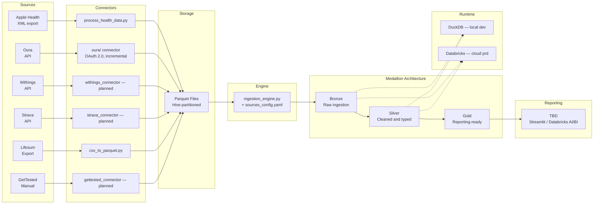
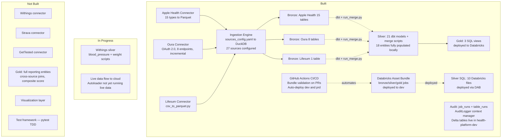

# ARCHITECTURE.md — HealthReporting

> Last updated: 2026-02-28
> For technical implementation details (silver pattern, merge scripts, hive partitioning), see `docs/architecture.md`.

---

## High-Level Data Flow



---

## Current State (What Exists Today)



---

## Medallion Layer Detail

### Bronze (Raw Ingestion)

| Table | Source | Status |
|-------|--------|--------|
| stg_apple_health_heart_rate | Apple Health | done |
| stg_apple_health_step_count | Apple Health | done |
| stg_apple_health_toothbrushing | Apple Health | done |
| stg_apple_health_body_temperature | Apple Health | done |
| stg_apple_health_respiratory_rate | Apple Health | done |
| stg_apple_health_water_intake | Apple Health | done |
| stg_apple_health_mindful_session | Apple Health | done |
| stg_apple_health_daily_walking_gait | Apple Health | done |
| stg_apple_health_daily_energy_by_source | Apple Health | done |
| stg_apple_health_* (6 more) | Apple Health | done |
| stg_oura_daily_sleep | Oura | done |
| stg_oura_daily_activity | Oura | done |
| stg_oura_daily_readiness | Oura | done |
| stg_oura_heartrate | Oura | done |
| stg_oura_workout | Oura | done |
| stg_oura_daily_spo2 | Oura | done |
| stg_oura_daily_stress | Oura | done |
| stg_oura_personal_info | Oura | done |
| stg_lifesum_food | Lifesum | done |
| stg_withings_* | Withings | not started |
| stg_strava_* | Strava | not started |
| stg_gettested_* | GetTested | not started |

### Silver (Cleaned and Transformed)

21 dbt schema models + 21 merge scripts. All run locally via DuckDB. 10 SQL files deployed to Databricks.

| Entity | Sources | Local | Databricks |
|--------|---------|-------|------------|
| heart_rate | Apple Health + Oura | done | SQL file |
| step_count | Apple Health | done | — |
| toothbrushing | Apple Health | done | — |
| body_temperature | Apple Health | done | — |
| respiratory_rate | Apple Health | done | — |
| water_intake | Apple Health | done | — |
| mindful_session | Apple Health | done | — |
| daily_walking_gait | Apple Health | done | — |
| daily_energy_by_source | Apple Health | done | — |
| daily_sleep | Oura | done | SQL file |
| daily_activity | Oura | done | SQL file |
| daily_readiness | Oura | done | SQL file |
| workout | Oura | done | — |
| daily_spo2 | Oura | done | — |
| daily_stress | Oura | done | — |
| personal_info | Oura | done | — |
| daily_meal | Lifesum | done | SQL file |
| blood_pressure | Withings | partial | — |
| weight | Withings | partial | — |
| daily_annotations | Manual | done | SQL file |

### Gold (Reporting-Ready)

| View | Description | Status |
|------|-------------|--------|
| daily_heart_rate_summary | Aggregated HR per day | done |
| vw_daily_annotations | Manual daily annotations | done |
| vw_heart_rate_avg_per_day | HR avg per day | done |

---

## Audit Layer

| Component | Description | Status |
|-----------|-------------|--------|
| AuditLogger | Python context manager, auto-detects DuckDB/Databricks | done |
| audit.job_runs | Delta table — pipeline run metadata | live in health-platform-dev |
| audit.table_runs | Delta table — per-table row counts | live in health-platform-dev |
| audit.v_platform_overview | View — 7-day success/error summary | done |

---

## File Structure Map

```
HealthReporting/
├── CLAUDE.md                              # session governance + conventions
├── docs/
│   ├── CONTEXT.md                         # project scope and data sources
│   ├── PROJECT_PLAN.md                    # phases and milestones
│   ├── ARCHITECTURE.md                    # this file — governance view
│   ├── CHANGELOG.md                       # session log
│   ├── architecture.md                    # technical reference (silver pattern, merge scripts)
│   ├── learnings.md                       # architectural decisions and lessons
│   ├── paths.md                           # key file paths
│   └── runbook.md                         # how to run the platform locally
├── .claude/
│   ├── commands/                          # 10 slash commands
│   └── agents/                            # 12 custom agents
└── health_unified_platform/
    ├── health_environment/
    │   ├── config/
    │   │   ├── environment_config.yaml
    │   │   └── sources_config.yaml        # 27 sources configured
    │   ├── connectors/
    │   │   └── oura/                      # OAuth 2.0 connector (auth, client, writer, state)
    │   └── deployment/
    │       └── databricks/
    │           ├── databricks.yml          # DAB bundle root
    │           ├── init.py                 # one-time schema + audit setup
    │           ├── orchestration/          # bronze_job.yml, silver_job.yml, gold_job.yml
    │           └── setup_audit_tables.sql
    └── health_platform/
        ├── source_connectors/
        │   ├── csv_to_parquet.py           # Lifesum and generic CSV
        │   ├── apple_health/
        │   │   └── process_health_data.py
        │   └── oura/                       # run_oura.py, auth.py, client.py, state.py, writer.py
        ├── utils/
        │   ├── audit_logger.py             # AuditLogger context manager
        │   └── logging_config.py           # Python logging setup
        └── transformation_logic/
            ├── ingestion_engine.py
            ├── dbt/
            │   ├── models/silver/          # 21 schema-only dbt models
            │   └── merge/silver/           # 21 merge scripts
            └── databricks/
                ├── bronze/                 # bronze_autoloader.py
                ├── silver/sql/             # 10 Databricks SQL files
                ├── gold/sql/               # 3 SQL views
                └── audit_logger_notebook.py
```

---

## Technology Stack

| Layer | Local (dev) | Cloud (prd) |
|-------|-------------|-------------|
| Runtime | DuckDB | Databricks |
| Storage | Parquet (hive-partitioned) | Delta Lake (Unity Catalog) |
| Orchestration | Python | Databricks Workflows (DAB) |
| Config | YAML (sources_config.yaml) | YAML |
| Catalog | — | health-platform-dev / health-platform-prd |
| Schemas | bronze, silver, gold | bronze, silver, gold, audit |
| CI/CD | — | GitHub Actions (deploy.yml) |
| Reporting | — (TBD) | Databricks AI/BI (planned) |
| Audit | AuditLogger to DuckDB | AuditLogger to Delta |
