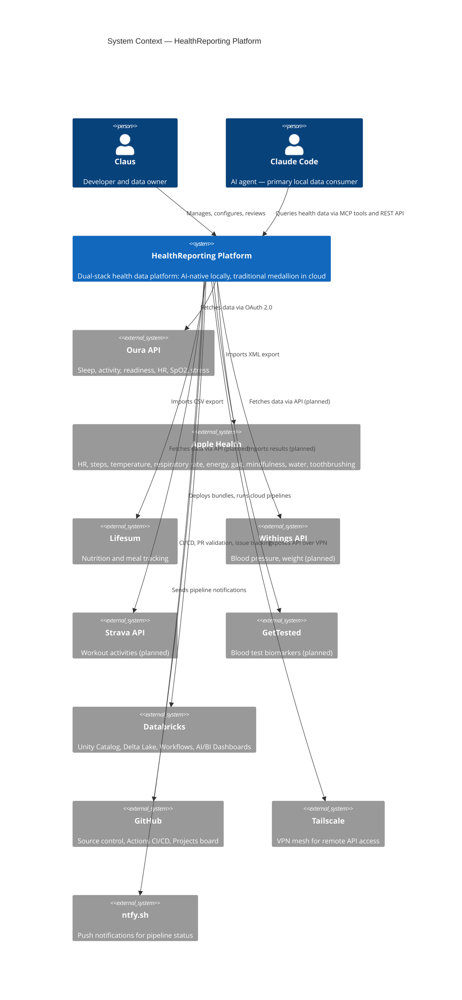
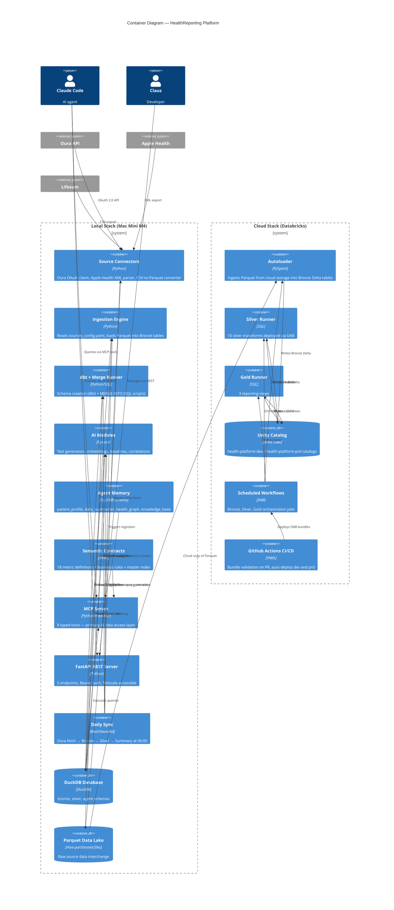
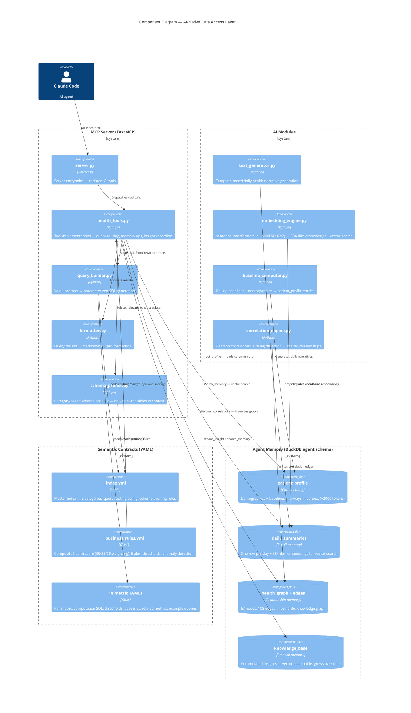

# C4 Architecture — HealthReporting

> Solution architecture narrative + C4 diagrams (Level 1–3).
> For detailed tables, file structure, and technology stack, see [ARCHITECTURE.md](./ARCHITECTURE.md).
> For an interactive view, see [architecture-diagram.html](./architecture-diagram.html).

---

## Solution Architecture Narrative

### Problem

Health data lives in silos. Oura knows sleep. Apple Health knows steps and heart rate. Lifesum knows nutrition. No single system connects them — and no system is designed for an AI agent to query.

Traditional data platforms solve this with a medallion architecture: Bronze (raw), Silver (clean), Gold (aggregated views for dashboards). But in this platform, the primary local consumer is not a human looking at dashboards — it is Claude Code, an AI agent querying data through MCP tools.

### The Dual-Stack Decision

The platform uses a **dual-stack architecture** where Silver is the shared layer and divergence happens after Silver:

- **Local (Mac Mini M4):** Silver feeds into an AI-native 2+2 model — Agent Memory (embeddings, knowledge graph, patient profile) and Semantic Contracts (YAML metric definitions exposed via 8 MCP tools). There is no Gold layer locally. The AI computes any aggregation on-demand in <100ms via DuckDB.
- **Cloud (Databricks):** Silver feeds into traditional Gold views for BI dashboards and enterprise consumers. This preserves the PoC value of demonstrating a standard medallion pattern.

This split exists because Gold encodes assumptions about what questions will be asked. An AI agent generates queries on-demand for any question — pre-aggregated views hide the detail it needs. At N=1 scale, materializing Gold locally is pure overhead. See [ADR-005](./adr/ADR-005-ai-native-data-model.md) for the full rationale.

### Key Properties

1. **Metadata-driven** — adding a new data source requires a YAML config entry, not code changes ([ADR-003](./adr/ADR-003-yaml-driven-pipeline.md))
2. **MCP-first** — AI never writes raw SQL. All data access goes through 8 typed MCP tools with semantic contracts
3. **Schema-as-documentation** — every column across 21 silver tables has a `COMMENT ON` description. The schema IS the AI's user interface (83% query accuracy vs 40% without)
4. **DuckDB local-first** — zero-config OLAP runtime, Parquet interchange format, single-writer simplicity ([ADR-001](./adr/ADR-001-duckdb-local-runtime.md))
5. **Medallion foundation** — Bronze → Silver shared across both stacks, source isolation via `source_system` column ([ADR-002](./adr/ADR-002-medallion-architecture.md))

---

## C4 Level 1: System Context

Who interacts with the platform, and what external systems does it depend on?

---

## C4 Level 2: Container Diagram

What are the major containers (deployable units) in each stack?

---

## C4 Level 3: Component Diagram — AI-Native Local Stack

Zooming into the MCP Server, AI Modules, Agent Memory, and Semantic Contracts — the components that make the local stack AI-native.

---

## Maintenance Notes

- **When to update these diagrams:** When a new data source connector is added, a new MCP tool is created, or the dual-stack boundary changes (e.g., new cloud services or local components).
- **For detailed tables** (bronze/silver/gold contents, file paths, technology stack): see [ARCHITECTURE.md](./ARCHITECTURE.md).
- **For interactive exploration:** see [architecture-diagram.html](./architecture-diagram.html).
- **Rendering:** GitHub renders Mermaid natively. For complex diagrams, use the [Mermaid Live Editor](https://mermaid.live) if nested boundaries render unexpectedly.
- **C4 plugin:** These diagrams use Mermaid's C4 extension (`C4Context`, `C4Container`, `C4Component`). Ensure your viewer supports C4 syntax.
