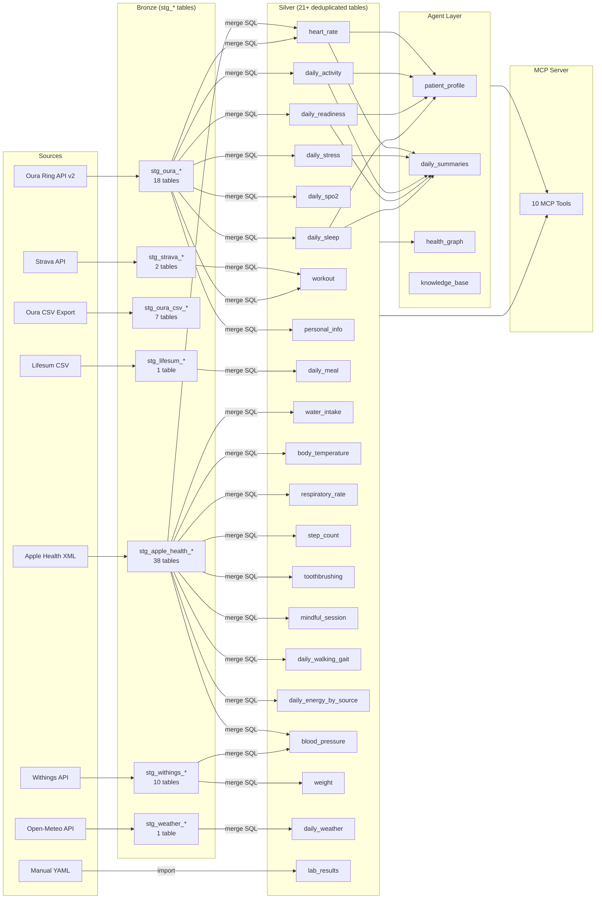
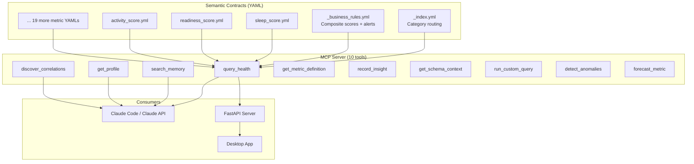

# Data Lineage — HealthReporting

> Complete data flow from source systems to silver layer and agent layer.
> Last updated: 2026-03-08

---

## High-Level Data Flow

---

## A. Source to Bronze Mapping

79 sources defined in `sources_config.yaml`. All load via `ingestion_engine.py`.

### Apple Health Sources (38 entries)

| Source Name | Parquet Path | Bronze Table |
|-------------|-------------|--------------|
| apple_health_toothbrushing | apple_health_data/Hygiene/toothbrushingevent/ | stg_apple_health_toothbrushing |
| apple_health_step_count | apple_health_data/Activity/stepcount/ | stg_apple_health_step_count |
| apple_health_heart_rate | apple_health_data/Vitality/heartrate/ | stg_apple_health_heart_rate |
| apple_health_vo2_max | apple_health_data/Vitality/vo2max/ | stg_apple_health_vo2_max |
| apple_health_water | apple_health_data/Nutrition/dietarywater/ | stg_apple_health_water |
| apple_health_body_temperature | apple_health_data/Vitality/bodytemperature/ | stg_apple_health_body_temperature |
| apple_health_respiratory_rate | apple_health_data/Vitality/respiratoryrate/ | stg_apple_health_respiratory_rate |
| apple_health_walking_steadiness | apple_health_data/Mobility/applewalkingsteadiness/ | stg_apple_health_walking_steadiness |
| apple_health_walking_asymmetry | apple_health_data/Mobility/walkingasymmetrypercentage/ | stg_apple_health_walking_asymmetry |
| apple_health_walking_double_support | apple_health_data/Mobility/walkingdoublesupportpercentage/ | stg_apple_health_walking_double_support |
| apple_health_walking_heart_rate_avg | apple_health_data/Mobility/walkingheartrateaverage/ | stg_apple_health_walking_heart_rate_avg |
| apple_health_walking_speed | apple_health_data/Mobility/walkingspeed/ | stg_apple_health_walking_speed |
| apple_health_walking_step_length | apple_health_data/Mobility/walkingsteplength/ | stg_apple_health_walking_step_length |
| apple_health_mindful_session | apple_health_data/Mindfulness/mindfulsession/ | stg_apple_health_mindful_session |
| apple_health_height | apple_health_data/BodyMetrics/height/ | stg_apple_health_height |
| apple_health_physical_effort | apple_health_data/Activity/physicaleffort/ | stg_apple_health_physical_effort |
| apple_health_basal_energy_burned | apple_health_data/Activity/basalenergyburned/ | stg_apple_health_basal_energy_burned |
| apple_health_active_energy_burned | apple_health_data/Activity/activeenergyburned/ | stg_apple_health_active_energy_burned |
| apple_health_hrv | apple_health_data/Vitality/heartratevariabilitysdnn/ | stg_apple_health_hrv |
| apple_health_hr_recovery | apple_health_data/Vitality/heartraterecoveryoneminute/ | stg_apple_health_hr_recovery |
| apple_health_resting_heart_rate | apple_health_data/Other/restingheartrate/ | stg_apple_health_resting_heart_rate |
| apple_health_six_min_walk | apple_health_data/Other/sixminutewalktestdistance/ | stg_apple_health_six_min_walk |
| apple_health_exercise_time | apple_health_data/Activity/appleexercisetime/ | stg_apple_health_exercise_time |
| apple_health_stand_time | apple_health_data/Activity/applestandtime/ | stg_apple_health_stand_time |
| apple_health_stand_hour | apple_health_data/Other/applestandhour/ | stg_apple_health_stand_hour |
| apple_health_distance_walking_running | apple_health_data/Activity/distancewalkingrunning/ | stg_apple_health_distance_walking_running |
| apple_health_distance_cycling | apple_health_data/Activity/distancecycling/ | stg_apple_health_distance_cycling |
| apple_health_flights_climbed | apple_health_data/Activity/flightsclimbed/ | stg_apple_health_flights_climbed |
| apple_health_running_speed | apple_health_data/Activity/runningspeed/ | stg_apple_health_running_speed |
| apple_health_hand_washing | apple_health_data/Hygiene/handwashingevent/ | stg_apple_health_hand_washing |
| apple_health_env_audio_exposure | apple_health_data/Environment/environmentalaudioexposure/ | stg_apple_health_env_audio_exposure |
| apple_health_headphone_audio_exposure | apple_health_data/Environment/headphoneaudioexposure/ | stg_apple_health_headphone_audio_exposure |
| apple_health_body_fat_percentage | apple_health_data/BodyMetrics/bodyfatpercentage/ | stg_apple_health_body_fat_percentage |
| apple_health_lean_body_mass | apple_health_data/BodyMetrics/leanbodymass/ | stg_apple_health_lean_body_mass |
| apple_health_bmi | apple_health_data/BodyMetrics/bodymassindex/ | stg_apple_health_bmi |
| apple_health_body_mass | apple_health_data/BodyMetrics/bodymass/ | stg_apple_health_body_mass |
| apple_health_bp_systolic | apple_health_data/Vitality/bloodpressuresystolic/ | stg_apple_health_bp_systolic |
| apple_health_bp_diastolic | apple_health_data/Vitality/bloodpressurediastolic/ | stg_apple_health_bp_diastolic |

### Oura API Sources (18 entries)

| Source Name | Parquet Path | Bronze Table |
|-------------|-------------|--------------|
| oura_daily_sleep | oura/raw/daily_sleep/ | stg_oura_daily_sleep |
| oura_daily_activity | oura/raw/daily_activity/ | stg_oura_daily_activity |
| oura_daily_readiness | oura/raw/daily_readiness/ | stg_oura_daily_readiness |
| oura_heartrate | oura/raw/heartrate/ | stg_oura_heartrate |
| oura_workout | oura/raw/workout/ | stg_oura_workout |
| oura_daily_spo2 | oura/raw/daily_spo2/ | stg_oura_daily_spo2 |
| oura_daily_stress | oura/raw/daily_stress/ | stg_oura_daily_stress |
| oura_personal_info | oura/raw/personal_info/ | stg_oura_personal_info |
| oura_daily_cardiovascular_age | oura/raw/daily_cardiovascular_age/ | stg_oura_daily_cardiovascular_age |
| oura_daily_resilience | oura/raw/daily_resilience/ | stg_oura_daily_resilience |
| oura_sleep_time | oura/raw/sleep_time/ | stg_oura_sleep_time |
| oura_enhanced_tag | oura/raw/enhanced_tag/ | stg_oura_enhanced_tag |
| oura_vo2_max | oura/raw/vo2_max/ | stg_oura_vo2_max |
| oura_session | oura/raw/session/ | stg_oura_session |
| oura_tag | oura/raw/tag/ | stg_oura_tag |
| oura_rest_mode_period | oura/raw/rest_mode_period/ | stg_oura_rest_mode_period |
| oura_ring_configuration | oura/raw/ring_configuration/ | stg_oura_ring_configuration |
| oura_sleep | oura/raw/sleep/ | stg_oura_sleep |

### Oura CSV Sources (7 entries)

| Source Name | Parquet Path | Bronze Table |
|-------------|-------------|--------------|
| oura_csv_dailyresilience | oura_csv/raw/dailyresilience/ | stg_oura_csv_dailyresilience |
| oura_csv_dailycardiovascularage | oura_csv/raw/dailycardiovascularage/ | stg_oura_csv_dailycardiovascularage |
| oura_csv_daytimestress | oura_csv/raw/daytimestress/ | stg_oura_csv_daytimestress |
| oura_csv_temperature | oura_csv/raw/temperature/ | stg_oura_csv_temperature |
| oura_csv_sleeptime | oura_csv/raw/sleeptime/ | stg_oura_csv_sleeptime |
| oura_csv_enhancedtag | oura_csv/raw/enhancedtag/ | stg_oura_csv_enhancedtag |
| oura_csv_sleepmodel | oura_csv/raw/sleepmodel/ | stg_oura_csv_sleepmodel |

### Withings API Sources (10 entries)

| Source Name | Parquet Path | Bronze Table |
|-------------|-------------|--------------|
| withings_weight | withings/raw/weight/ | stg_withings_weight |
| withings_blood_pressure | withings/raw/blood_pressure/ | stg_withings_blood_pressure |
| withings_temperature | withings/raw/temperature/ | stg_withings_temperature |
| withings_sleep | withings/raw/sleep/ | stg_withings_sleep |
| withings_signal | withings/raw/signal/ | stg_withings_signal |
| withings_pwv | withings/raw/pwv/ | stg_withings_pwv |
| withings_body_temperature | withings/raw/body_temperature/ | stg_withings_body_temperature |
| withings_sleep_summary | withings/raw/sleep_summary/ | stg_withings_sleep_summary |
| withings_sleep_raw | withings/raw/sleep_raw/ | stg_withings_sleep_raw |
| withings_heart_list | withings/raw/heart_list/ | stg_withings_heart_list |

### Strava API Sources (2 entries)

| Source Name | Parquet Path | Bronze Table |
|-------------|-------------|--------------|
| strava_activities | strava/raw/activities/ | stg_strava_activities |
| strava_athlete_stats | strava/raw/athlete_stats/ | stg_strava_athlete_stats |

### Other Sources (4 entries)

| Source Name | Parquet Path | Bronze Table | Notes |
|-------------|-------------|--------------|-------|
| lifesum_food | lifesum/parquet/food/ | stg_lifesum_food | CSV converted via csv_to_parquet.py |
| weather_open_meteo | weather/raw/open_meteo/ | stg_weather_open_meteo | Free API, no auth |
| manual_lab_results | manual/lab_results/ | silver.lab_results | YAML, loaded directly to silver |
| manual_supplements | manual/supplement_protocol.yaml | silver.supplement_log | YAML, loaded directly to silver |

---

## B. Bronze to Silver Mapping

51 merge SQL scripts in `transformation_logic/dbt/merge/silver/`. Each runs as a MERGE (upsert) or INSERT with deduplication.

### Apple Health Merge Scripts (24)

| Merge Script | Bronze Source(s) | Silver Table |
|-------------|------------------|-------------|
| merge_apple_health_heart_rate.sql | stg_apple_health_heart_rate | heart_rate |
| merge_apple_health_step_count.sql | stg_apple_health_step_count | step_count |
| merge_apple_health_toothbrushing.sql | stg_apple_health_toothbrushing | toothbrushing |
| merge_apple_health_body_temperature.sql | stg_apple_health_body_temperature | body_temperature |
| merge_apple_health_respiratory_rate.sql | stg_apple_health_respiratory_rate | respiratory_rate |
| merge_apple_health_water.sql | stg_apple_health_water | water_intake |
| merge_apple_health_mindful_session.sql | stg_apple_health_mindful_session | mindful_session |
| merge_apple_health_walking_gait.sql | stg_apple_health_walking_gait_* | daily_walking_gait |
| merge_apple_health_energy.sql | stg_apple_health_*_energy_burned | daily_energy_by_source |
| merge_apple_health_hrv.sql | stg_apple_health_hrv | heart_rate (HRV column) |
| merge_apple_health_resting_heart_rate.sql | stg_apple_health_resting_heart_rate | heart_rate |
| merge_apple_health_hr_recovery.sql | stg_apple_health_hr_recovery | heart_rate |
| merge_apple_health_vo2_max.sql | stg_apple_health_vo2_max | (vo2_max metrics) |
| merge_apple_health_blood_pressure_v2.sql | stg_apple_health_bp_systolic, stg_apple_health_bp_diastolic | blood_pressure |
| merge_apple_health_body_measurement.sql | stg_apple_health_body_mass, stg_apple_health_bmi, etc. | (body measurement metrics) |
| merge_apple_health_distance.sql | stg_apple_health_distance_* | (distance metrics) |
| merge_apple_health_exercise_time.sql | stg_apple_health_exercise_time | (exercise time metrics) |
| merge_apple_health_flights_climbed.sql | stg_apple_health_flights_climbed | (flights climbed metrics) |
| merge_apple_health_hand_washing.sql | stg_apple_health_hand_washing | (hand washing metrics) |
| merge_apple_health_physical_effort.sql | stg_apple_health_physical_effort | (physical effort metrics) |
| merge_apple_health_running_speed.sql | stg_apple_health_running_speed | (running speed metrics) |
| merge_apple_health_six_min_walk.sql | stg_apple_health_six_min_walk | (six min walk metrics) |
| merge_apple_health_stand_time.sql | stg_apple_health_stand_time | (stand time metrics) |
| merge_apple_health_audio_exposure.sql | stg_apple_health_*_audio_exposure | (audio exposure metrics) |

### Oura API Merge Scripts (8)

| Merge Script | Bronze Source(s) | Silver Table |
|-------------|------------------|-------------|
| merge_oura_daily_sleep.sql | stg_oura_daily_sleep | daily_sleep |
| merge_oura_daily_activity.sql | stg_oura_daily_activity | daily_activity |
| merge_oura_daily_readiness.sql | stg_oura_daily_readiness | daily_readiness |
| merge_oura_heartrate.sql | stg_oura_heartrate | heart_rate |
| merge_oura_workout.sql | stg_oura_workout | workout |
| merge_oura_daily_spo2.sql | stg_oura_daily_spo2 | daily_spo2 |
| merge_oura_daily_stress.sql | stg_oura_daily_stress | daily_stress |
| merge_oura_personal_info.sql | stg_oura_personal_info | personal_info |
| merge_oura_blood_oxygen.sql | stg_oura_daily_spo2 | (blood oxygen detail) |

### Oura CSV Merge Scripts (7)

| Merge Script | Bronze Source(s) | Silver Table |
|-------------|------------------|-------------|
| merge_oura_csv_cardiovascular_age.sql | stg_oura_csv_dailycardiovascularage | (cardiovascular age) |
| merge_oura_csv_daily_resilience.sql | stg_oura_csv_dailyresilience | (daily resilience) |
| merge_oura_csv_daytime_stress.sql | stg_oura_csv_daytimestress | (daytime stress detail) |
| merge_oura_csv_enhanced_tag.sql | stg_oura_csv_enhancedtag | (enhanced tags) |
| merge_oura_csv_skin_temperature.sql | stg_oura_csv_temperature | (skin temperature) |
| merge_oura_csv_sleep_recommendation.sql | stg_oura_csv_sleeptime | (sleep recommendation) |
| merge_oura_csv_sleep_session.sql | stg_oura_csv_sleepmodel | (sleep session detail) |

### Withings Merge Scripts (8)

| Merge Script | Bronze Source(s) | Silver Table |
|-------------|------------------|-------------|
| merge_withings_weight.sql | stg_withings_weight | weight |
| merge_withings_blood_pressure.sql | stg_withings_blood_pressure | blood_pressure |
| merge_withings_blood_pressure_v2.sql | stg_withings_blood_pressure | blood_pressure (v2 schema) |
| merge_withings_body_measurement.sql | stg_withings_weight | (body composition detail) |
| merge_withings_body_temperature.sql | stg_withings_body_temperature | body_temperature |
| merge_withings_ecg_session.sql | stg_withings_signal | (ECG session data) |
| merge_withings_pulse_wave_velocity.sql | stg_withings_pwv | (pulse wave velocity) |
| merge_withings_sleep_session.sql | stg_withings_sleep | (Withings sleep data) |

### Other Merge Scripts (3)

| Merge Script | Bronze Source(s) | Silver Table |
|-------------|------------------|-------------|
| merge_strava_activities.sql | stg_strava_activities | workout |
| merge_weather_daily.sql | stg_weather_open_meteo | daily_weather |
| merge_lifesum_food.sql | stg_lifesum_food | daily_meal |

### Cross-Source Tables

Some silver tables merge data from multiple sources:

| Silver Table | Sources | Deduplication Strategy |
|-------------|---------|----------------------|
| heart_rate | Oura API + Apple Health | source_system column, timestamp-based dedup |
| blood_pressure | Withings API + Apple Health | source_system column, datetime-based dedup |
| workout | Oura API + Strava API + Lifesum | source_system column, cross-source duplicate detection |
| body_temperature | Apple Health + Withings | source_system column |

---

## C. Silver to Agent Layer

The agent layer derives higher-order representations from silver tables.

### patient_profile (agent.patient_profile)

| Profile Entry | Silver Source(s) | Computation |
|---------------|-----------------|-------------|
| baseline_resting_hr | heart_rate | 90-day median of daily min BPM |
| baseline_sleep_score | daily_sleep | 90-day median sleep score |
| baseline_steps | daily_activity | 90-day median daily steps |
| baseline_readiness | daily_readiness | 90-day median readiness score |
| baseline_weight | weight | 90-day median weight |
| demographics_age | personal_info | Calculated from birthday |
| demographics_sex | personal_info | From Oura profile |
| demographics_height | personal_info | From Oura profile |
| demographics_weight | weight | Latest measurement |

Computed by `ai/baseline_computer.py`. Refreshed in Step 7 of daily_sync.sh.

### daily_summaries (agent.daily_summaries)

| Component | Silver Source(s) | Processing |
|-----------|-----------------|------------|
| Summary text | daily_sleep, daily_readiness, daily_activity, daily_stress, heart_rate, daily_spo2, daily_meal, workout | Template-based text generation via `ai/text_generator.py` |
| Embedding vector | (summary text) | sentence-transformers (all-MiniLM-L6-v2, 384-dim) via `ai/embedding_engine.py` |

One row per day. Generated in Step 5 of daily_sync.sh. Supports vector similarity search via DuckDB VSS (HNSW index).

### health_graph (agent.health_graph + agent.health_graph_edges)

| Content | Source | Count |
|---------|--------|-------|
| Biomarker nodes | Seeded from medical knowledge | 67 nodes |
| Relationship edges | Seeded + computed correlations | 108+ edges |
| Metric correlations | Silver tables via `ai/correlation_engine.py` | Grows via Step 6 |

Seeded by `setup/seed_health_graph.sql`. Enhanced by correlation computation in Step 6 of daily_sync.sh.

### knowledge_base (agent.knowledge_base)

| Content | Source | Processing |
|---------|--------|------------|
| Accumulated insights | MCP `record_insight` tool | User or AI-generated observations, vector-indexed |

Grows organically via the MCP `record_insight` tool. Each entry gets an embedding for semantic search.

---

## D. Refresh Frequency

The `daily_sync.sh` pipeline runs 7 steps daily at 06:00 via launchd.

| Step | What | Frequency | Script / Module |
|------|------|-----------|-----------------|
| 1 | Fetch from API sources (Oura, Withings, Strava, Weather) | Daily 06:00 | source_connectors/*/run_*.py |
| 2 | Bronze ingestion (parquet to DuckDB) | Daily 06:00 | ingestion_engine.py |
| 3 | Silver merge (51 merge SQL scripts) | Daily 06:00 | run_merge.py + merge_*.sql |
| 4 | Data quality checks (YAML-driven) | Daily 06:00 | scripts/run_quality_checks.py |
| 5 | Daily summary + embedding generation | Daily 06:00 | ai/text_generator.py + ai/embedding_engine.py |
| 6 | Correlation computation | Daily 06:00 | ai/correlation_engine.py |
| 7 | Patient profile refresh (baselines) | Daily 06:00 | ai/baseline_computer.py |

### Source-Specific Refresh

| Source | Method | Frequency | Notes |
|--------|--------|-----------|-------|
| Oura Ring | API v2 (OAuth2) | Daily via daily_sync.sh | Incremental fetch from last state |
| Apple Health | XML export to parquet | Manual (periodic) | Export from iPhone, run process_health_data.py |
| Lifesum | CSV export to parquet | Manual (periodic) | Export from app, run csv_to_parquet.py |
| Withings | API (OAuth2) | Daily via daily_sync.sh | Weight, BP, temperature, sleep, signal, PWV |
| Strava | API (OAuth2) | Daily via daily_sync.sh | Activities and athlete stats |
| Open-Meteo | REST API (no auth) | Daily via daily_sync.sh | Weather data for local area |
| Lab results | Manual YAML | Per lab test | Imported via import_manual_data.py |
| Supplements | Manual YAML | When protocol changes | Single YAML file |

---

## E. Semantic Contract Layer

YAML metric contracts (`contracts/metrics/`) define how the AI agent queries silver tables. This is not a data flow but an access layer.

The MCP server uses `query_builder.py` to translate YAML contract SQL templates into parameterized DuckDB queries. The AI agent never writes raw SQL — it calls MCP tools which read contracts.
